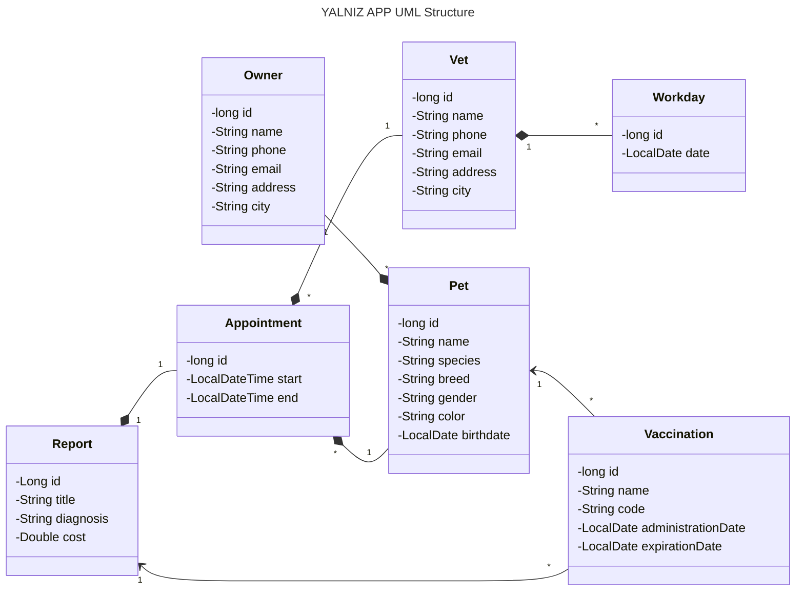

# yalniz-app
Veterinary practice management system developed as a Web App using Spring Boot and React under the hood.

## UML Structure

```mermaid
---
title: YALNIZ APP UML Structure
---
classDiagram
    direction LR
    Owner "1" --* "*" Pet
    Pet "1" <-- "*" Vaccination
    Vet "1" *-- "*" Workday
    Appointment "*" *-- "1" Vet
    Appointment "*" *-- "1" Pet
    Report "1" *-- "1" Appointment
    Report "1" <-- "*" Vaccination
    

    class Report {
        -Long id
        -String title
        -String diagnosis
        -Double cost
    }

    class Pet {
        -long id
        -String name
        -String species
        -String breed
        -String gender
        -String color
        -LocalDate birthdate
    }

    class Owner {
        -long id
        -String name
        -String phone
        -String email
        -String address
        -String city
    }

    class Vaccination {
        -long id
        -String name
        -String code
        -LocalDate administrationDate
        -LocalDate expirationDate
    }

    class Vet {
        -long id
        -String name
        -String phone
        -String email
        -String address
        -String city
    }

    class Workday {
        -long id
        -LocalDate date
    }

    class Appointment {
        -long id
        -LocalDateTime start
        -LocalDateTime end
    }

```