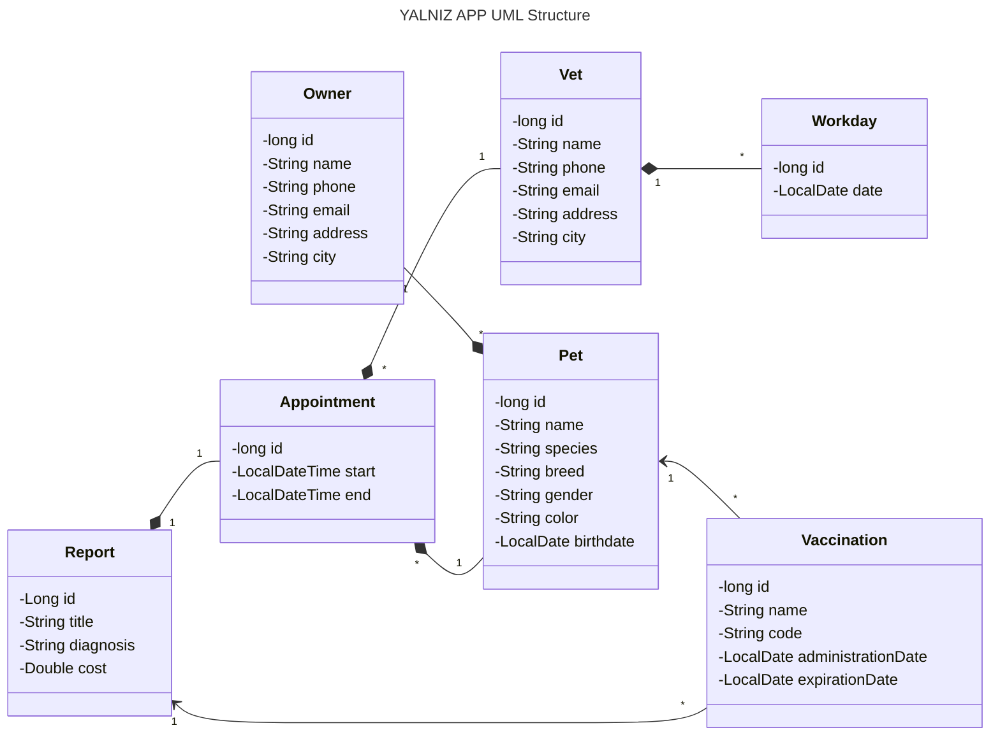

YALNIZ APP - A Full Stack Veterinary Practice Management APP
===============================================

Yalnız App is a web app built on top of React and Java Spring Boot. It is in monolithic architecture and has a RESTful API.
Production database is PostgreSQL.

This project is developed as the capstone project of Java Spring Boot module
of Patika+ Java/React FullStack Web Development bootcamp organized by [Patika](https://patika.dev).

See the videos of the project on YouTube:
- [APP TEST](https://youtu.be/TN0llLV7z9s)
- [APP CODE WALKTHROUGH](https://youtu.be/rCXxATNvkog)

## Table of Contents

- [About](#yalniz-api---veterinary-practice-management-api)
- [What's in the name?](#whats-in-the-name)
- [How to test the project](#how-to-test-the-project)
- [APIs](#apis)
- [UML structure](#uml-structure)
- [Request Body Templates](#request-body-templates)
    - [Appointment](#appointment)
    - [Owner](#owner)
    - [Pet](#pet)
    - [Vaccination](#vaccination)
    - [Vet](#vet)
    - [Workday](#workday)

## What's in the name?

YALNIZ was the name I gave to a cat. She was a little one,
wandering **ALONE** in the forest where she saw me and ran in the hope of finding a new home.
She was a very cute and lovely cat. Could not bring her with me when I got back to the city.

One day, when I came back to the village, she was gone. Nowhere to be found.
Then I heard from the folks around. They told me that she was a strong one.
That she would bully the other cats in the village. That she was a fighter. That she was a survivor.
Yet she was found dead by the road, lived **YALNIZ** and died **ALONE**.

In the memory of YALNIZ, I named this project after her.

## How to test the project

You may use the frontend part of the project to test the API: [https://yalniz-app.vercel.app/#/dashboard](https://yalniz-app.vercel.app/#/dashboard)

Or use the [https://yalnizapp-1-0-0.onrender.com](https://yalnizapp-1-0-0.onrender.com) address to test the api directly.
Consider using Swagger for testing: [https://yalnizapp-1-0-0.onrender.com/swagger-ui.html](https://yalnizapp-1-0-0.onrender.com/swagger-ui.html)

## UML Structure



## APIs

Go to [swagger-ui.html](https://yalnizapp-1-0-0.onrender.com/swagger-ui.html) to see the API documentation.

## Request Body Templates

### Appointment

#### Appointment Save Request

```json
{
  "start": "yyyy-MM-dd'T'HH:mm:ss",
  "petId": 1,
  "vetId": 1
}
```

#### Appointment Update Request

```json
{
  "id": 1,
  "start": "yyyy-MM-dd'T'HH:mm:ss",
  "petId": 1,
  "vetId": 1
}
```

#### Appointment Response

```json
{
  "id": 1,
  "start": "yyyy-MM-dd'T'HH:mm:ss",
  "petId": 1,
  "vetId": 1
}
```

### Owner

#### Owner Save Request

```json
{
  "name": "string",
  "phone": "string",
  "email": "string",
  "address": "string",
  "city": "string"
}
```

#### Owner Update Request

```json
{
  "id": 1,
  "name": "string",
  "phone": "string",
  "email": "string",
  "address": "string",
  "city": "string"
}
```

#### Owner Response

*pets array has [PetResponse](#pet-response) objects.

```json
{
  "id": 1,
  "name": "string",
  "phone": "string",
  "email": "string",
  "address": "string",
  "city": "string",
  "pets": []
}
```

### Pet

#### Pet Save Request

```json
{
  "name": "string",
  "species": "string",
  "breed": "string",
  "gender": "string",
  "color": "string",
  "birthdate": "yyyy-MM-dd",
  "ownerId": 1
}
```

#### Pet Update Request

```json
{
  "id": 1,
  "name": "string",
  "species": "string",
  "breed": "string",
  "gender": "string",
  "color": "string",
  "birthdate": "yyyy-MM-dd",
  "ownerId": 1
}
```

#### Pet Response

```json
{
  "id": 1,
  "name": "string",
  "species": "string",
  "breed": "string",
  "gender": "string",
  "color": "string",
  "birthdate": "yyyy-MM-dd",
  "ownerId": 1
}
```

### Vaccination

#### Vaccination Save Request

```json
{
  "name": "string",
  "code": "string",
  "administrationDate": "yyyy-MM-dd",
  "expirationDate": "yyyy-MM-dd",
  "petId": 1
}
```

#### Vaccination Update Request

```json
{
  "id": 1,
  "name": "string",
  "code": "string",
  "administrationDate": "yyyy-MM-dd",
  "expirationDate": "yyyy-MM-dd",
  "petId": 1
}
```

#### Vaccination Response

```json
{
  "id": 1,
  "name": "string",
  "code": "string",
  "administrationDate": "yyyy-MM-dd",
  "expirationDate": "yyyy-MM-dd",
  "petId": 1
}
```

### Vet

#### Vet Save Request

```json
{
  "name": "string",
  "phone": "string",
  "email": "string",
  "address": "string",
  "city": "string"
}
```

#### Vet Update Request

```json
{
  "id": 1,
  "name": "string",
  "phone": "string",
  "email": "string",
  "address": "string",
  "city": "string"
}
```

#### Vet Response

```json
{
  "id": 1,
  "name": "string",
  "phone": "string",
  "email": "string",
  "address": "string",
  "city": "string"
}
```

### Workday

#### Workday Save Request

```json
{
  "date": "yyyy-MM-dd",
  "vetId": 1
}
```

#### Workday Update Request

```json
{
  "id": 1,
  "date": "yyyy-MM-dd",
  "vetId": 1
}
```

#### Workday Response

```json
{
  "id": 1,
  "date": "yyyy-MM-dd",
  "vetId": 1
}
```